# webapp

Webアプリ開発関連技術の勉強用

- Web アプリ本体だけではなく、 DB や フロントエンド、 API 、認証などとの連携も含める。
- 各種言語やフレームワーク、ツールの種類を切り替え可能なように、できるだけ疎結合なサンプルアプリを作成する。
  - プラグインやアダプタ、インターフェースによるカプセル化など
- 最終的にプロセス毎に Docker コンテナとして起動する想定

以下の操作を実装する。

1. Web アプリ用のサイトにアクセス
2. ログイン
3. 何らかのサービスを提供
   1. 最低限、データの登録、参照、編集、削除
      1. 扱うデータはテキスト、画像、音声、その他
   2. 内部でデータ処理のために DB アクセスや API 実行などを実施
   3. GUI だけではなく RESTful API も提供
4. ログアウト

## システム構成

- 環境
  - 開発環境
  - テスト環境
  - 運用環境
- 構成管理サーバー
- クライアント
  - Web ブラウザ
  - curl コマンド（ REST API 実行用）
- サーバー
  - フロントエンド
    - Web サーバー
  - バックエンド
    - アプリケーション（ AP ）サーバー
      - 主に API サーバーとして利用
    - ストレージ
      - データベース（ DB ）
    - ユーザ管理サーバー
    - API 管理サーバー
    - ログ管理サーバー
