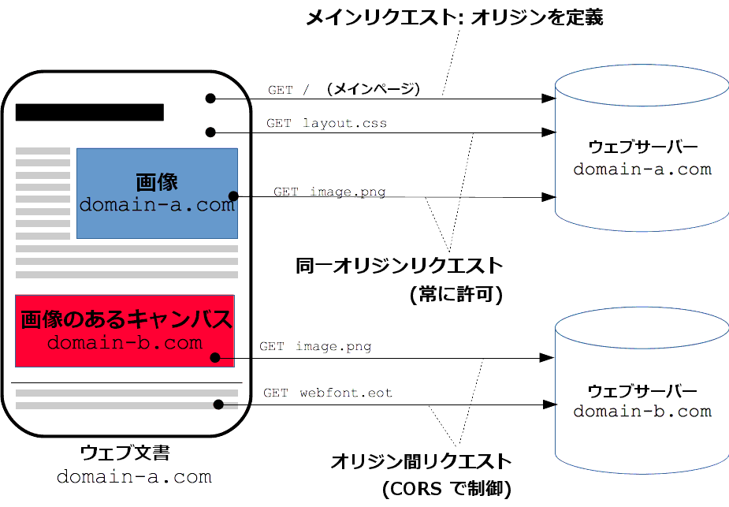

= Jakarta RESTful Web Services

* https://jakarta.ee/specifications/restful-ws/3.0/[ドキュメント]
* https://jakarta.ee/specifications/restful-ws/3.0/jakarta-restful-ws-spec-3.0.html[仕様]
* https://jakarta.ee/specifications/restful-ws/3.0/apidocs/[Javadoc]

== 実装

https://eclipse-ee4j.github.io/jersey/download.html[Eclipse Jersey]

== サンプル

. プロジェクト作成／移動
+
[source,shell]
----
docker run \
  --rm \
  -it \
  -u 1000:1000 \
  -v "$HOME/.m2":/var/maven/.m2 \
  -v "$PWD:/usr/src/mymaven" \
  -w /usr/src/mymaven \
  -e MAVEN_CONFIG=/var/maven/.m2 \
  maven:3-openjdk-11 \
    mvn archetype:generate \
      -Duser.home=/var/maven \
      -DarchetypeGroupId=org.glassfish.jersey.archetypes \
      -DarchetypeArtifactId=jersey-quickstart-webapp \
      -DarchetypeVersion=3.0.3 \
      -DinteractiveMode=false \
      -DgroupId=com.gmail.peregrin8alde.rest \
      -DartifactId=restapp01 \
      -Dversion=0.1.0-SNAPSHOT

cd restapp01
----
. Payara にデプロイする場合、 CDI 関連の設定が必要
+
[source,xml]
----
tee src/main/webapp/WEB-INF/beans.xml <<'EOF' >> /dev/null
<beans xmlns="https://jakarta.ee/xml/ns/jakartaee"
        xmlns:xsi="http://www.w3.org/2001/XMLSchema-instance"
        xsi:schemaLocation="https://jakarta.ee/xml/ns/jakartaee https://jakarta.ee/xml/ns/jakartaee/beans_3_0.xsd"
        version="3.0"
        bean-discovery-mode="none">
</beans>
EOF
----
. コンパイル
+
[source,shell]
----
docker run \
  --rm \
  -it \
  -u 1000:1000 \
  -v "$HOME/.m2":/var/maven/.m2 \
  -v "$PWD:/usr/src/mymaven" \
  -w /usr/src/mymaven \
  -e MAVEN_CONFIG=/var/maven/.m2 \
  maven:3-openjdk-11 \
    mvn compile \
      -Duser.home=/var/maven
----
. テスト
+
[source,shell]
----
docker run \
  --rm \
  -it \
  -u 1000:1000 \
  -v "$HOME/.m2":/var/maven/.m2 \
  -v "$PWD:/usr/src/mymaven" \
  -w /usr/src/mymaven \
  -e MAVEN_CONFIG=/var/maven/.m2 \
  maven:3-openjdk-11 \
    mvn test \
      -Duser.home=/var/maven
----
. ビルド（＋クリーン）
+
[source,shell]
----
docker run \
  --rm \
  -it \
  -u 1000:1000 \
  -v "$HOME/.m2":/var/maven/.m2 \
  -v "$PWD:/usr/src/mymaven" \
  -w /usr/src/mymaven \
  -e MAVEN_CONFIG=/var/maven/.m2 \
  maven:3-openjdk-11 \
    mvn clean package \
      -Duser.home=/var/maven
----
. 動作確認
+
[source,shell]
----
cd ..
cp restapp01/target/restapp01.war webapps/

docker run \
  -it \
  --rm \
  -p 8080:8080 \
  -p 8181:8181 \
  -p 4848:4848 \
  -p 9009:9009 \
  -v "$PWD/webapps":/opt/payara/deployments \
  payara/server-web:5.2021.10-jdk11
----
** http://localhost:8080/restapp01 に接続すると Jersey の Welcome ページが表示される。
** 以下で REST API にリクエストを実行と `Got it!` がレスポンスで返ってくる。
+
[source,shell]
----
curl -XGET http://localhost:8080/restapp01/webapi/myresource
----

== JSON の扱い

以下の２つの方法がある。

* https://jakarta.ee/specifications/restful-ws/3.0/jakarta-restful-ws-spec-3.0.html#jsonp[Java API for JSON Processing(JSON-P)]
** https://jakarta.ee/specifications/jsonp/2.0/[ドキュメント群]
** https://jakarta.ee/specifications/jsonp/2.0/apidocs/[JSON Processing API documentation]
** ストリーミング API またはオブジェクトモデル API を用いて JSON を扱うことができる。
*** ストリーミング API : ストリーミング方式で JSON の解析／生成を行う。先頭からイベントベースで処理を行う場合向け。
*** オブジェクトモデル API : メモリ上でランダムアクセスツリー構造で JSON を扱う。ランダムアクセス向けだが、メモリを多く使用。
** 実装においては、 https://jakarta.ee/specifications/jsonp/2.0/apidocs/jakarta.json/jakarta/json/jsonvalue[JsonValue] 
およびそのサブクラスに対する entity providers を全てサポートする必要がある。
** `JsonParser` などの JSON-P API も `InputStream` / `StreamingOutput` の entity providers を使って JAX-RS アプリに統合可能。
* https://jakarta.ee/specifications/restful-ws/3.0/jakarta-restful-ws-spec-3.0.html#jsonb[Java API for JSON Binding(JSON-B)]
** https://jakarta.ee/specifications/jsonb/2.0/[ドキュメント群]
** https://jakarta.ee/specifications/jsonb/2.0/jakarta-jsonb-spec-2.0.html[仕様]
** https://jakarta.ee/specifications/jsonb/2.0/apidocs/[Jakarta JSON Binding 2.0.0 API Specification]
** Java オブジェクトと JSON ドキュメント間で変換を行うためのバインディングフレームワーク
** 実装においては、 `application/json` や `text/json` といった `/json` または `/*+json` にマッチするメディアタイプと
組み合わせて使う上で JSON-B がサポートする全ての Java データ型に対する entity providers をサポートする必要がある。
** `JSON-P` と `JSON-B` の両方を同じ環境でサポートしている場合、 JSON-P の `JsonValue` とそのサブクラスに対する entity providers 
を除いて、 JSON-B の entity providers が優先される。

リクエストを受け取ったりレスポンスを返したりするときに使われるデータ型が、

* JSON-P : JsonValue 系
* JSON-B : JsonValue 系以外の任意のクラス

となる。

=== Entity Providers

https://jakarta.ee/specifications/restful-ws/3.0/jakarta-restful-ws-spec-3.0.html#entity_providers[Entity Providers] は
リクエストの https://jakarta.ee/specifications/restful-ws/3.0/jakarta-restful-ws-spec-3.0.html#entity_parameters[Entity Parameters] に
対し、エンティティ本体とJava のデータ型をマッピングしてくれるもの。

* `Message Body Reader` と `Message Body Writer` インターフェースがあり、 これらの実装クラスには
`@Provider` アノテーションを付けておくと自動検出される。
** `Message Body Reader` : リクエストを受け取る際の Java オブジェクトへの変換
** `Message Body Writer` : レスポンスを返す際の Java オブジェクトからの変換
* `@Consumes` （ Reader 側）や `@Produces` （ Writer 側）アノテーションを使うことで
サポートするメディアタイプを限定できる。
* 実装においては、 https://jakarta.ee/specifications/restful-ws/3.0/jakarta-restful-ws-spec-3.0.html#standard_entity_providers[Standard Entity Providers] に
記載されている組み合わせは最低限サポートする必要がある。

=== JSON-P

Eclipse Jersey で JSON-P を利用する場合。

参考 : https://eclipse-ee4j.github.io/jersey.github.io/documentation/latest/media.html#json.json-p[Chapter 9. Support for Common Media Type Representations - 9.1.3. Java API for JSON Processing (JSON-P)]

==== 依存関係

`pom.xml` で以下の依存関係の追加を行う。

[source,xml]
----
<dependency>
    <groupId>org.glassfish.jersey.media</groupId>
    <artifactId>jersey-media-json-processing</artifactId>
    <version>2.35</version>
</dependency>
----

==== 設定

自動検出可能な機能のため、基本は設定不要。

==== サンプル

https://github.com/eclipse-ee4j/jersey/tree/master/examples/json-processing-webapp[JSON Processing example]

かなり古いため、パッケージ名で `javax` => `jakarta` の変換が必要。
ただし、 `javax.json` は何故か `jakarta.json` が参照できずビルドでエラーとなったため、保留。

上記サンプルの場合、以下で動作確認可能（ URL 内の `/webapi` 部分は `web.xml` に記述された `<url-pattern>/webapi/*</url-pattern>` の影響）。

. 一括登録
+
.一括登録
[#ex-multipost]
====
[source,shell]
----
curl \
  -H "Content-Type: application/json" \
  -X POST \
  --data '[{"name":"Jersey","site":"http://jersey.java.net"},{"age":33,"phone":"158158158","name":"Foo"},{"name":"JSON-P","site":"http://jsonp.java.net"}]' \
  http://localhost:8080/restapp01/webapi/document/multiple
----
====
+
.<<ex-multipost>> の結果
[%collapsible.result]
====
[source,shell]
----
[1,2,3]
----
====
. 全件参照
+
.全件参照
[#ex-getall]
====
[source,shell]
----
curl \
  -X GET \
  http://localhost:8080/restapp01/webapi/document
----
====
+
.<<ex-getall>> の結果
[%collapsible.result]
====
[source,shell]
----
[{"name":"Jersey","site":"http://jersey.java.net"},{"age":33,"phone":"158158158","name":"Foo"},{"name":"JSON-P","site":"http://jsonp.java.net"}]
----
====
. ID 指定参照
+
.ID 指定参照
[#ex-getbyid]
====
[source,shell]
----
curl \
  -X GET \
  http://localhost:8080/restapp01/webapi/document/1
----
====
+
.<<ex-getbyid>> の結果
[%collapsible.result]
====
[source,shell]
----
{"name":"Jersey","site":"http://jersey.java.net"}
----
====
. フィルタリング
+
.フィルタリング
[#ex-filter]
====
[source,shell]
----
curl \
  -H "Content-Type: application/json" \
  -X POST \
  --data '["site"]' \
  http://localhost:8080/restapp01/webapi/document/filter

curl -XGET http://localhost:8080/restapp01/webapi/document/filter
----
====
+
.<<ex-filter>> の結果
[%collapsible.result]
====
[source,shell]
----
[{"site":"http://jersey.java.net"},{"site":"http://jsonp.java.net"}]
----
====

=== JSON-B

Eclipse Jersey で JSON-B を利用する場合。

参考 : https://eclipse-ee4j.github.io/jersey.github.io/documentation/latest/media.html#json.json-b[Chapter 9. Support for Common Media Type Representations - 9.1.7. Java API for JSON Binding (JSON-B)]

ライブラリとしては Yasson が使われている。

==== 依存関係

`pom.xml` で以下の依存関係の追加を行う。
（ `jersey-quickstart-webapp` で自動生成された `pom.xml` の場合は元々コメントアウトされた状態で version 以外の記述がある）

[source,xml]
----
<dependency>
    <groupId>org.glassfish.jersey.media</groupId>
    <artifactId>jersey-media-json-binding</artifactId>
    <version>2.35</version>
</dependency>
----

==== 設定

自動検出可能な機能のため、基本は設定不要。

==== サンプル

https://github.com/eclipse-ee4j/jersey/tree/master/examples/json-binding-webapp[JSON-B example]

かなり古いため、パッケージ名で `javax` => `jakarta` の変換が必要。
ただし、 `javax.json` は `jakarta.json` が参照できずビルドでエラーとなったため、保留。
pom の依存関係のバージョンなどは正しいように見える。
`mvn dependency:tree` では以下が出力されるし、 `org.glassfish:jakarta.json` はリポジトリに jar が存在する。。
（逆に `javax.json` がどこから出てきたのかが不明）

[source,shell]
----
[INFO] com.gmail.peregrin8alde.rest:restapp01:war:0.1.0-SNAPSHOT
[INFO] +- org.glassfish.jersey.containers:jersey-container-servlet-core:jar:3.0.3:compile
[INFO] |  +- jakarta.inject:jakarta.inject-api:jar:2.0.0:compile
[INFO] |  +- org.glassfish.jersey.core:jersey-common:jar:3.0.3:compile
[INFO] |  |  +- jakarta.annotation:jakarta.annotation-api:jar:2.0.0:compile
[INFO] |  |  \- org.glassfish.hk2:osgi-resource-locator:jar:1.0.3:compile
[INFO] |  +- org.glassfish.jersey.core:jersey-server:jar:3.0.3:compile
[INFO] |  |  +- org.glassfish.jersey.core:jersey-client:jar:3.0.3:compile
[INFO] |  |  \- jakarta.validation:jakarta.validation-api:jar:3.0.0:compile
[INFO] |  \- jakarta.ws.rs:jakarta.ws.rs-api:jar:3.0.0:compile
[INFO] +- org.glassfish.jersey.inject:jersey-hk2:jar:3.0.3:compile
[INFO] |  +- org.glassfish.hk2:hk2-locator:jar:3.0.1:compile
[INFO] |  |  +- org.glassfish.hk2.external:aopalliance-repackaged:jar:3.0.1:compile
[INFO] |  |  +- org.glassfish.hk2:hk2-api:jar:3.0.1:compile
[INFO] |  |  \- org.glassfish.hk2:hk2-utils:jar:3.0.1:compile
[INFO] |  \- org.javassist:javassist:jar:3.25.0-GA:compile
[INFO] +- org.glassfish.jersey.media:jersey-media-json-binding:jar:2.35:compile
[INFO] |  +- org.glassfish:jakarta.json:jar:1.1.6:compile
[INFO] |  +- org.eclipse:yasson:jar:1.0.9:compile
[INFO] |  |  \- org.glassfish:jakarta.json:jar:module:1.1.6:compile
[INFO] |  +- jakarta.json.bind:jakarta.json.bind-api:jar:1.0.2:compile
[INFO] |  \- jakarta.json:jakarta.json-api:jar:1.1.6:compile
[INFO] \- org.glassfish.jersey.media:jersey-media-json-processing:jar:2.35:compile
[INFO]    \- org.glassfish:jsonp-jaxrs:jar:1.1.6:compile
----

以下で動作確認可能（ URL 内の `/webapi` 部分は `web.xml` に記述された `<url-pattern>/webapi/*</url-pattern>` の影響）。

. 登録
+
.登録
[#ex-cats-post]
====
[source,shell]
----
curl \
  -v \
  -X POST \
  -H "Content-Type: application/json" \
  --data ' {"color":"white","sort":"maine coon","catName":"Darwin", "domesticated":"true"}' \
  http://localhost:8080/restapp01/webapi/cats/add
----
====
+
.<<ex-cats-post>> の結果
[%collapsible.result]
====
`POST is already inferred` は curl が `-d` 利用時に自動で POST するから不要だという旨らしい。
+
[source,shell]
----
Note: Unnecessary use of -X or --request, POST is already inferred.
*   Trying 127.0.0.1:8080...
* TCP_NODELAY set
* Connected to localhost (127.0.0.1) port 8080 (#0)
> POST /restapp01/webapi/cats/add HTTP/1.1
> Host: localhost:8080
> User-Agent: curl/7.68.0
> Accept: */*
> Content-Type: application/json
> Content-Length: 80
> 
* upload completely sent off: 80 out of 80 bytes
* Mark bundle as not supporting multiuse
< HTTP/1.1 200 OK
< Server: Payara Server  5.2021.10 #badassfish
< X-Powered-By: Servlet/4.0 JSP/2.3 (Payara Server  5.2021.10 #badassfish Java/Azul Systems, Inc./11)
< Content-Length: 0
< X-Frame-Options: SAMEORIGIN
< 
* Connection #0 to host localhost left intact
----
====
. 参照
+
.参照
[#ex-cats-get]
====
[source,shell]
----
curl \
  -X GET \
  http://localhost:8080/restapp01/webapi/cats/one
----
====
+
.<<ex-cats-get>> の結果
[%collapsible.result]
====
[source,json]
----
{"color":"ginger","catSort":"semi-british","catName":"Alfred","domesticated":true}
----
====
. 全件参照
+
.全件参照
[#ex-cats-getall]
====
[source,shell]
----
curl \
  -X GET \
  http://localhost:8080/restapp01/webapi/cats/all
----
====
+
.<<ex-cats-getall>> の結果
[%collapsible.result]
====
[source,json]
----
[{"color":"tabby","catSort":"semi-british","catName":"Rosa","domesticated":true},{"color":"ginger","catSort":"semi-british","catName":"Alfred","domesticated":true},{"color":"blue/silver","catSort":"british blue","catName":"Mishan","domesticated":true},{"color":"stracciatella","catSort":"common cat","catName":"Costa","domesticated":true},{"color":"white","catSort":"maine coon","catName":"Darwin","domesticated":true}]
----
====

== CORS

https://developer.mozilla.org/ja/docs/Web/HTTP/CORS[オリジン間リソース共有 (CORS)]

[quote, MDN Web Docs,'オリジン間リソース共有 (CORS), https://developer.mozilla.org/ja/docs/Web/HTTP/CORS[cors_principle.png]' ]
____
オリジン間リクエストとは、例えば https://domain-a.com で提供されているウェブアプリケーションのフロントエンド JavaScript コードが XMLHttpRequest を使用して https://domain-b.com/data.json へリクエストを行うような場合です。

____

https://developer.mozilla.org/ja/docs/Glossary/Preflight_request[CORS プリフライト] が発生しない場合と発生する場合で対処が
異なる。

=== プリフライトが発生しない場合

以下の条件を全て満たす場合、 CORS プリフライトが発生しない。
参考 : https://developer.mozilla.org/ja/docs/Web/HTTP/CORS#%E5%8D%98%E7%B4%94%E3%83%AA%E3%82%AF%E3%82%A8%E3%82%B9%E3%83%88[単純リクエスト]

* 許可されているメソッドのうちのいずれかであること。
** GET
** HEAD
** POST
* ユーザーエージェントによって自動的に設定されたヘッダーを除いて、手動で設定できるヘッダーが以下のヘッダーだけ。
** Accept
** Accept-Language
** Content-Language
** https://developer.mozilla.org/ja/docs/Web/HTTP/Headers/Content-Type[Content-Type] (但し、以下の値のみ)
*** application/x-www-form-urlencoded
*** multipart/form-data
*** text/plain
** XMLHttpRequest オブジェクトを使用してリクエストを行う場合、
+
[quote, MDN Web Docs,'オリジン間リソース共有 (CORS), https://developer.mozilla.org/ja/docs/Web/HTTP/CORS#%E5%8D%98%E7%B4%94%E3%83%AA%E3%82%AF%E3%82%A8%E3%82%B9%E3%83%88[単純リクエスト]' ]
____
XMLHttpRequest.upload プロパティから返されるオブジェクトにイベントリスナーが登録されていないこと。すなわち、 XMLHttpRequest インスタンスを xhr とした場合、どのコードも xhr.upload.addEventListener() が呼び出してアップロードを監視するためのイベントリスナーを追加していないこと。
____
** リクエストに ReadableStream オブジェクトが使用されていないこと。

この場合、サーバからのレスポンスヘッダーにおいて https://developer.mozilla.org/ja/docs/Web/HTTP/Headers/Access-Control-Allow-Origin[Access-Control-Allow-Origin] 
で許可するクライアント（ `Origin` ヘッダーの値）を指定することで解決可能。

* どこからのアクセスでも許可する場合 : `Access-Control-Allow-Origin: *`
* 指定の URL からのアクセスを許可する場合 : `Access-Control-Allow-Origin: <origin>`

基本的に全てのレスポンスへ追加することになるため、 https://jakarta.ee/specifications/restful-ws/3.0/jakarta-restful-ws-spec-3.0.html#filters[Filters]
の `ContainerResponse` を使うことになる。

* https://jakarta.ee/specifications/restful-ws/3.0/apidocs/jakarta/ws/rs/container/containerresponsefilter[JAX-RS の Interface ContainerResponseFilter]
* https://eclipse-ee4j.github.io/jersey.github.io/documentation/latest/filters-and-interceptors.html[Eclipse Jersey での Filters]
* https://eclipse-ee4j.github.io/jaxrs-api/apidocs/2.1.6/javax/ws/rs/container/ContainerResponseFilter.html[Eclipse Jersey での Interface ContainerResponseFilter]
+
.ContainerResponseFilter サンプル
[source,java]
----
import java.io.IOException;
import javax.ws.rs.container.ContainerRequestContext;
import javax.ws.rs.container.ContainerResponseContext;
import javax.ws.rs.container.ContainerResponseFilter;
import javax.ws.rs.core.Response;
 
public class PoweredByResponseFilter implements ContainerResponseFilter {
 
    @Override
    public void filter(ContainerRequestContext requestContext, ContainerResponseContext responseContext)
        throws IOException {
 
            responseContext.getHeaders().add("X-Powered-By", "Jersey :-)");
    }
}
----

.CORS 用の ContainerResponseFilter サンプル
[source,java]
----
import java.io.IOException;
import jakarta.ws.rs.container.ContainerRequestContext;
import jakarta.ws.rs.container.ContainerResponseContext;
import jakarta.ws.rs.container.ContainerResponseFilter;
import jakarta.ws.rs.ext.Provider;

@Provider
public class CorsFilter implements ContainerResponseFilter {
 
    @Override
    public void filter(ContainerRequestContext requestContext, ContainerResponseContext responseContext)
        throws IOException {

            responseContext.getHeaders().add("Access-Control-Allow-Origin", "*");
    }
}
----

`@Provider` は `web.xml` 編集しないで自動適用するために付与している。

=== プリフライトが発生する場合

前述のプリフライトが発生しない場合を除いて、特別な通信が発生する。

[quote, MDN Web Docs,'オリジン間リソース共有 (CORS), https://developer.mozilla.org/ja/docs/Web/HTTP/CORS#preflighted_requests[プリフライトリクエスト]' ]
____
「プリフライト」リクエストは始めに OPTIONS メソッドによる HTTP リクエストを他のドメインにあるリソースに向けて送り、
実際のリクエストを送信しても安全かどうかを確かめます。サイト間リクエストがユーザーデータに影響を与える可能性が
あるような場合に、このようにプリフライトを行います。
____

この場合、サーバからのレスポンスヘッダーにおいて以下の値を設定することで解決可能。

* https://developer.mozilla.org/ja/docs/Web/HTTP/Headers/Access-Control-Allow-Methods[Access-Control-Allow-Method]
** 許可したいメソッドを指定する。
* https://developer.mozilla.org/ja/docs/Web/HTTP/Headers/Access-Control-Allow-Headers[Access-Control-Allow-Headers]
** 許可したいカスタムヘッダーを指定する。

.CORS （プリフライト対応付き）用の ContainerResponseFilter サンプル
[source,java]
----
import java.io.IOException;
import jakarta.ws.rs.container.ContainerRequestContext;
import jakarta.ws.rs.container.ContainerResponseContext;
import jakarta.ws.rs.container.ContainerResponseFilter;
import jakarta.ws.rs.ext.Provider;

@Provider
public class CorsFilter implements ContainerResponseFilter {
 
    @Override
    public void filter(ContainerRequestContext requestContext, ContainerResponseContext responseContext)
        throws IOException {

            responseContext.getHeaders().add("Access-Control-Allow-Origin", "*");
            responseContext.getHeaders().add("Access-Control-Allow-Method", "POST, PUT, DELETE");
            responseContext.getHeaders().add("Access-Control-Allow-Headers", "X-PINGOTHER, Content-Type");
    }
}
----

